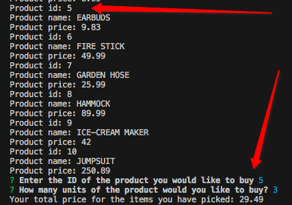
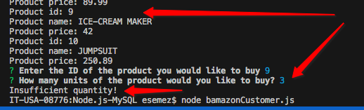
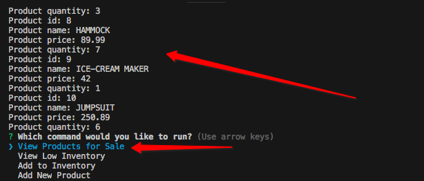
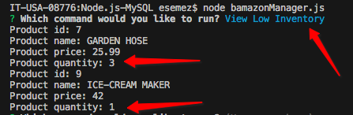
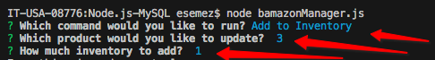
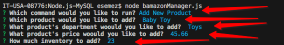
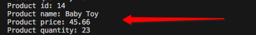

# Node.js-MySQL
1. user usage for bamazonCustomer:
Happy Pass:
Enter the ID of the product you would like to buy form 1 to 10
How many units of the product would you like to buy? 

Error Pass:
what if there are not enough items in stock

2. user usage for bamazonManager:
from the list of commands pick the one you would like to run:
- "View Products for Sale"
- "View Low Inventory"
- "Add to Inventory"
- "Add New Product"

First case: View Products for Sale

Second case: View Low Inventory

Third case: Add to Inventory

Forth case: Add New Product

result:
